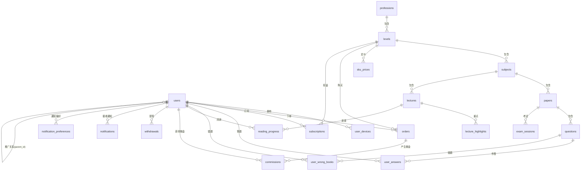

# 医学宝典 - 数据库设计文档

> 基于 MySQL 8.0 设计，字符集使用 `utf8mb4`，排序规则 `utf8mb4_unicode_ci`。

---

## 1. 用户与鉴权 (User & Auth)

### `users` 用户表
| 字段名 | 类型 | 必填 | 说明 |
|---|---|---|---|
| id | BIGINT | YES | 主键，自增 |
| username | VARCHAR(50) | NO | 用户名/昵称 |
| phone | VARCHAR(20) | NO | 手机号（唯一索引） |
| email | VARCHAR(100) | NO | 邮箱（唯一索引） |
| password_hash | VARCHAR(255) | NO | 加盐哈希密码 |
| avatar_url | VARCHAR(255) | NO | 头像 URL |
| wechat_openid | VARCHAR(64) | NO | 微信 OpenID |
| wechat_unionid | VARCHAR(64) | NO | 微信 UnionID |
| parent_id | BIGINT | NO | 上线用户 ID（外键 -> users.id） |
| invite_code | VARCHAR(10) | YES | 个人邀请码（唯一索引） |
| balance | DECIMAL(10, 2) | YES | 账户余额（默认 0.00） |
| current_level_id | INT | NO | 当前选中的考种等级 ID |
| status | TINYINT | YES | 1:正常, 0:禁用, 2:注销申请中 |
| closed_at | DATETIME | NO | 注销申请时间（7天后永久删除） |
| created_at | DATETIME | YES | 创建时间 |
| updated_at | DATETIME | YES | 更新时间 |

### `user_devices` 用户设备表
| 字段名 | 类型 | 必填 | 说明 |
|---|---|---|---|
| id | BIGINT | YES | 主键 |
| user_id | BIGINT | YES | 用户 ID |
| device_id | VARCHAR(100) | YES | 设备唯一标识 |
| device_name | VARCHAR(50) | NO | 设备名称（如 iPhone 13） |
| ip_address | VARCHAR(45) | NO | 最后登录 IP |
| last_login_at | DATETIME | YES | 最后登录时间 |
| token_signature | VARCHAR(255) | YES | 当前有效 Token 签名 |

### `verification_codes` 验证码表
| 字段名 | 类型 | 必填 | 说明 |
|---|---|---|---|
| id | BIGINT | YES | 主键 |
| target | VARCHAR(100) | YES | 手机号或邮箱 |
| code | VARCHAR(6) | YES | 验证码 |
| type | TINYINT | YES | 1:注册, 2:登录, 3:修改密码 |
| expire_at | DATETIME | YES | 过期时间 |
| used | TINYINT | YES | 0:未使用, 1:已使用 |
| created_at | DATETIME | YES | 创建时间 |

### `system_configs` 系统配置表
| 字段名 | 类型 | 必填 | 说明 |
|---|---|---|---|
| id | INT | YES | 主键 |
| config_key | VARCHAR(50) | YES | 配置键（唯一） |
| config_value | TEXT | YES | 配置值 |
| description | VARCHAR(200) | NO | 配置说明 |
| updated_at | DATETIME | YES | 更新时间 |

> **预置配置项**：
> - `register_enabled`: 是否开放注册 (1/0)
> - `max_device_count`: 单账号最大在线设备数 (默认 1)
> - `commission_freeze_days`: 佣金冻结天数 (默认 7)

---

## 2. SKU 核心架构 (SKU Architecture)

### `professions` 职业大类表
| 字段名 | 类型 | 必填 | 说明 |
|---|---|---|---|
| id | INT | YES | 主键 |
| name | VARCHAR(50) | YES | 名称（如：临床检验师） |
| sort_order | INT | YES | 排序权重 |

### `levels` 职业等级表 (售卖单元)
| 字段名 | 类型 | 必填 | 说明 |
|---|---|---|---|
| id | INT | YES | 主键 |
| profession_id | INT | YES | 所属大类 ID |
| name | VARCHAR(50) | YES | 名称（如：中级） |
| commission_rate | DECIMAL(4, 2) | YES | 分销佣金比例（如 0.10 表示 10%） |
| sort_order | INT | YES | 排序权重 |

### `subjects` 科目表
| 字段名 | 类型 | 必填 | 说明 |
|---|---|---|---|
| id | INT | YES | 主键 |
| level_id | INT | YES | 所属等级 ID |
| name | VARCHAR(50) | YES | 名称（如：临床免疫学） |
| sort_order | INT | YES | 排序权重 |

### `sku_prices` SKU 定价表
| 字段名 | 类型 | 必填 | 说明 |
|---|---|---|---|
| id | INT | YES | 主键 |
| level_id | INT | YES | 关联等级 ID |
| duration_type | ENUM | YES | 'MONTH', 'QUARTER', 'YEAR' |
| price | DECIMAL(10, 2) | YES | 价格 |
| original_price | DECIMAL(10, 2) | NO | 原价（划线价） |

---

## 3. 题库系统 (Question Bank)

### `papers` 试卷表
| 字段名 | 类型 | 必填 | 说明 |
|---|---|---|---|
| id | BIGINT | YES | 主键 |
| subject_id | INT | YES | 所属科目 ID |
| name | VARCHAR(100) | YES | 试卷名称 |
| type | TINYINT | YES | 1:真题, 2:模拟题 |
| year | INT | NO | 年份（真题用） |
| question_count | INT | YES | 题目数量 |
| difficulty | TINYINT | YES | 难度系数 1-5 |

### `questions` 题目表
| 字段名 | 类型 | 必填 | 说明 |
|---|---|---|---|
| id | BIGINT | YES | 主键 |
| paper_id | BIGINT | YES | 所属试卷 ID |
| type | TINYINT | YES | 1:单选题 |
| content | TEXT | YES | 题干内容（支持 HTML/Markdown） |
| options | JSON | YES | 选项 JSON `[{"key":"A","val":"..."}, ...]` |
| correct_option | CHAR(1) | YES | 正确选项（A/B/C/D） |
| analysis | TEXT | NO | 解析 |
| sort_order | INT | YES | 题目在试卷中的顺序 |

### `user_wrong_books` 错题本表
| 字段名 | 类型 | 必填 | 说明 |
|---|---|---|---|
| id | BIGINT | YES | 主键 |
| user_id | BIGINT | YES | 用户 ID |
| question_id | BIGINT | YES | 题目 ID |
| subject_id | INT | YES | 科目 ID（冗余字段，便于筛选） |
| wrong_count | INT | YES | 错误次数 |
| last_wrong_at | DATETIME | YES | 最后错误时间 |
| is_deleted | TINYINT | YES | 0:未移出, 1:已移出 |

### `user_answers` 用户答题记录表
| 字段名 | 类型 | 必填 | 说明 |
|---|---|---|---|
| id | BIGINT | YES | 主键 |
| user_id | BIGINT | YES | 用户 ID |
| paper_id | BIGINT | YES | 试卷 ID |
| question_id | BIGINT | YES | 题目 ID |
| user_option | CHAR(1) | YES | 用户选择的选项 |
| is_correct | TINYINT | YES | 0:错误, 1:正确 |
| mode | TINYINT | YES | 1:考试模式, 2:练习模式, 3:错题组卷 |
| session_id | VARCHAR(36) | YES | 答题会话 ID（用于断点续答） |
| created_at | DATETIME | YES | 答题时间 |

### `exam_sessions` 考试会话表
| 字段名 | 类型 | 必填 | 说明 |
|---|---|---|---|
| id | VARCHAR(36) | YES | 会话 ID (UUID) |
| user_id | BIGINT | YES | 用户 ID |
| paper_id | BIGINT | YES | 试卷 ID |
| mode | TINYINT | YES | 1:考试模式, 2:练习模式 |
| question_order | JSON | YES | 题目顺序 JSON 数组 |
| time_limit | INT | NO | 倒计时秒数（考试模式） |
| start_at | DATETIME | YES | 开始时间 |
| submit_at | DATETIME | NO | 交卷时间 |
| score | INT | NO | 得分 |
| status | TINYINT | YES | 0:进行中, 1:已交卷 |

---

## 4. 讲义与重点 (Lectures)

### `lectures` 讲义表
| 字段名 | 类型 | 必填 | 说明 |
|---|---|---|---|
| id | INT | YES | 主键 |
| subject_id | INT | YES | 所属科目 ID |
| title | VARCHAR(100) | YES | 讲义标题 |
| file_url | VARCHAR(255) | YES | PDF 文件 OSS 地址 |
| page_count | INT | YES | 总页数 |

### `lecture_highlights` 讲义重点表
| 字段名 | 类型 | 必填 | 说明 |
|---|---|---|---|
| id | BIGINT | YES | 主键 |
| lecture_id | INT | YES | 讲义 ID |
| teacher_id | BIGINT | YES | 标注教师 ID |
| page_index | INT | YES | 页码（从 1 开始） |
| data | JSON | YES | 坐标数据 `[{"x":10,"y":20,"w":100,"h":50,"color":"#ff0"}, ...]` |
| created_at | DATETIME | YES | 创建时间 |
| updated_at | DATETIME | YES | 更新时间 |

### `reading_progress` 阅读进度表
| 字段名 | 类型 | 必填 | 说明 |
|---|---|---|---|
| id | BIGINT | YES | 主键 |
| user_id | BIGINT | YES | 用户 ID |
| lecture_id | INT | YES | 讲义 ID |
| last_page | INT | YES | 最后阅读页码 |
| updated_at | DATETIME | YES | 更新时间 |

---

## 5. 订单与支付 (Orders)

### `orders` 订单表
| 字段名 | 类型 | 必填 | 说明 |
|---|---|---|---|
| id | BIGINT | YES | 主键 |
| order_no | VARCHAR(32) | YES | 订单号（唯一） |
| user_id | BIGINT | YES | 用户 ID |
| level_id | INT | YES | 购买等级 ID |
| amount | DECIMAL(10, 2) | YES | 订单金额 |
| status | TINYINT | YES | 0:待支付, 1:已支付, 2:已取消 |
| pay_method | TINYINT | NO | 1:支付宝, 2:微信 |
| paid_at | DATETIME | NO | 支付时间 |

### `subscriptions` 订阅权益表
| 字段名 | 类型 | 必填 | 说明 |
|---|---|---|---|
| id | BIGINT | YES | 主键 |
| user_id | BIGINT | YES | 用户 ID |
| level_id | INT | YES | 拥有权益的等级 ID |
| start_at | DATETIME | YES | 生效时间 |
| expire_at | DATETIME | YES | 过期时间 |

---

## 6. 分销与工单 (Affiliate)

### `commissions` 佣金流水表
| 字段名 | 类型 | 必填 | 说明 |
|---|---|---|---|
| id | BIGINT | YES | 主键 |
| user_id | BIGINT | YES | 受益人（上线）ID |
| source_order_id | BIGINT | YES | 来源订单 ID |
| amount | DECIMAL(10, 2) | YES | 佣金金额 |
| status | TINYINT | YES | 0:冻结中, 1:已解冻/可用 |
| unlock_at | DATETIME | YES | 预计解冻时间 |

### `withdrawals` 提现工单表
| 字段名 | 类型 | 必填 | 说明 |
|---|---|---|---|
| id | BIGINT | YES | 主键 |
| user_id | BIGINT | YES | 申请人 ID |
| amount | DECIMAL(10, 2) | YES | 提现金额 |
| account_info | JSON | YES | 收款账号信息 `{"type":"alipay","account":"xxx","name":"张三"}` |
| status | TINYINT | YES | 0:待审核, 1:审核通过, 2:打款中, 3:已完成, 4:已拒绝 |
| reject_reason | VARCHAR(255) | NO | 拒绝原因（拒绝时必填） |
| refund_amount | DECIMAL(10, 2) | NO | 退回金额（拒绝时设置，默认全额退回） |
| admin_id | BIGINT | NO | 审核管理员 ID |
| admin_remark | VARCHAR(255) | NO | 管理员备注 |
| created_at | DATETIME | YES | 申请时间 |
| updated_at | DATETIME | YES | 更新时间 |

---

## 7. 通知系统 (Notification)

### `notifications` 通知记录表
| 字段名 | 类型 | 必填 | 说明 |
|---|---|---|---|
| id | BIGINT | YES | 主键，自增 |
| user_id | BIGINT | YES | 用户 ID（外键 -> users.id） |
| type | ENUM | YES | 通知类型：account, order, subscription, commission, withdrawal, marketing, system |
| channel | ENUM | YES | 通知渠道：email, sms, in_app |
| title | VARCHAR(255) | YES | 通知标题 |
| content | TEXT | YES | 通知内容 |
| variables | JSON | NO | 模板变量，JSON 格式存储 |
| recipient | VARCHAR(255) | NO | 收件人地址（邮箱或手机号） |
| status | TINYINT | YES | 发送状态：0-待发送，1-发送中，2-成功，3-失败 |
| error_message | TEXT | NO | 发送失败的错误信息 |
| is_read | BOOLEAN | YES | 是否已读（仅应用内通知有效） |
| read_at | DATETIME | NO | 已读时间 |
| metadata | JSON | NO | 关联业务数据，如订单号、交易号等 |
| scheduled_at | DATETIME | NO | 计划发送时间（用于定时发送） |
| sent_at | DATETIME | NO | 实际发送时间 |
| retry_count | INT | YES | 重试次数 |
| created_at | DATETIME | YES | 创建时间 |

### `notification_templates` 通知模板表
| 字段名 | 类型 | 必填 | 说明 |
|---|---|---|---|
| id | BIGINT | YES | 主键，自增 |
| code | VARCHAR(50) | YES | 模板代码（唯一） |
| channel | ENUM | YES | 通知渠道：email, sms, in_app |
| type | ENUM | YES | 通知类型：account, order, subscription, commission, withdrawal, marketing, system |
| title_template | VARCHAR(255) | YES | 标题模板（支持 `{{变量名}}` 占位符） |
| content_template | TEXT | YES | 内容模板（支持 `{{变量名}}` 占位符） |
| description | VARCHAR(200) | NO | 模板说明 |
| is_enabled | BOOLEAN | YES | 是否启用 |
| created_at | DATETIME | YES | 创建时间 |
| updated_at | DATETIME | YES | 更新时间 |

### `notification_preferences` 通知偏好设置表
| 字段名 | 类型 | 必填 | 说明 |
|---|---|---|---|
| id | BIGINT | YES | 主键，自增 |
| user_id | BIGINT | YES | 用户 ID（唯一） |
| email_enabled | BOOLEAN | YES | 是否启用邮件通知 |
| sms_enabled | BOOLEAN | YES | 是否启用短信通知 |
| in_app_enabled | BOOLEAN | YES | 是否启用应用内通知 |
| account_email | BOOLEAN | YES | 账户相关-邮件 |
| account_sms | BOOLEAN | YES | 账户相关-短信 |
| account_in_app | BOOLEAN | YES | 账户相关-应用内 |
| order_email | BOOLEAN | YES | 订单相关-邮件 |
| order_sms | BOOLEAN | YES | 订单相关-短信 |
| order_in_app | BOOLEAN | YES | 订单相关-应用内 |
| subscription_email | BOOLEAN | YES | 订阅相关-邮件 |
| subscription_sms | BOOLEAN | YES | 订阅相关-短信 |
| subscription_in_app | BOOLEAN | YES | 订阅相关-应用内 |
| commission_email | BOOLEAN | YES | 佣金相关-邮件 |
| commission_sms | BOOLEAN | YES | 佣金相关-短信 |
| commission_in_app | BOOLEAN | YES | 佣金相关-应用内 |
| withdrawal_email | BOOLEAN | YES | 提现相关-邮件 |
| withdrawal_sms | BOOLEAN | YES | 提现相关-短信 |
| withdrawal_in_app | BOOLEAN | YES | 提现相关-应用内 |
| marketing_email | BOOLEAN | YES | 营销相关-邮件 |
| marketing_sms | BOOLEAN | YES | 营销相关-短信 |
| marketing_in_app | BOOLEAN | YES | 营销相关-应用内 |
| system_in_app | BOOLEAN | YES | 系统通知-应用内 |
| created_at | DATETIME | YES | 创建时间 |
| updated_at | DATETIME | YES | 更新时间 |

---

## 8. ER 关系图 (Entity Relationship)

---

## 9. 索引建议 (Index Recommendations)

| 表名 | 索引字段 | 类型 | 说明 |
|------|----------|------|------|
| users | phone | UNIQUE | 手机号唯一 |
| users | email | UNIQUE | 邮箱唯一 |
| users | invite_code | UNIQUE | 邀请码唯一 |
| users | parent_id | INDEX | 查询下线 |
| user_devices | user_id, device_id | UNIQUE | 用户设备唯一 |
| user_answers | user_id, paper_id | INDEX | 用户试卷答题记录 |
| user_answers | session_id, user_id | INDEX | 答题会话查询 (PERF-002) |
| user_wrong_books | user_id, subject_id, is_deleted | INDEX | 错题本筛选 |
| orders | order_no | UNIQUE | 订单号唯一 |
| orders | user_id, status | INDEX | 用户订单查询 |
| subscriptions | user_id, level_id, expire_at | INDEX | 权益校验 |
| commissions | user_id, status | INDEX | 佣金查询 |
| commissions | status, unlock_at | INDEX | 佣金解冻查询 (PERF-002) |
| withdrawals | user_id, status | INDEX | 提现工单查询 (PERF-002) |
| exam_sessions | user_id, is_deleted, start_at | INDEX | 用户考试历史查询 (PERF-002) |
| exam_sessions | id, user_id | INDEX | 考试会话查询 (PERF-002) |
| questions | paper_id, sort_order | INDEX | 试卷题目查询 (PERF-002) |
| papers | subject_id, status | INDEX | 科目试卷筛选 (PERF-002) |
| papers | year, type | INDEX | 年份类型排序 (PERF-002) |
| lectures | subject_id, is_active, status | INDEX | 科目讲义筛选 (PERF-002) |
| lecture_highlights | lecture_id, page_index | INDEX | 按页查重点 |
| reading_progress | user_id, lecture_id | UNIQUE | 用户讲义阅读进度 |
| verification_codes | phone, type | INDEX | 手机验证码查询 |
| verification_codes | email, type | INDEX | 邮箱验证码查询 |
| notifications | user_id | INDEX | 用户通知查询 |
| notifications | user_id, is_read | INDEX | 用户未读通知查询 |
| notifications | user_id, channel, type | INDEX | 通知筛选查询 |
| notifications | status, scheduled_at | INDEX | 计划发送通知查询 |
| notifications | status, retry_count | INDEX | 失败重试查询 |
| notification_templates | code, channel | UNIQUE | 模板代码唯一 |
| notification_preferences | user_id | UNIQUE | 用户偏好唯一 |

### 9.1 索引策略说明

详见 [数据库索引策略文档](../docs/database-index-strategy.md)，包含：
- 完整的索引分析与实施计划
- 查询性能优化目标
- 索引监控与维护策略
