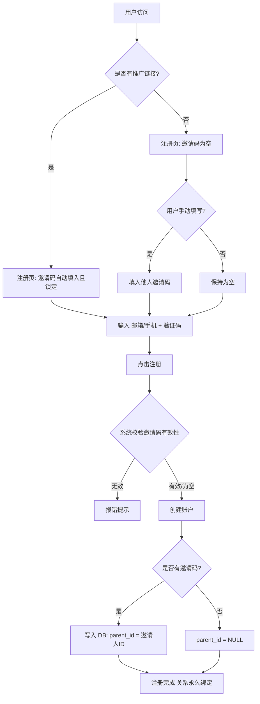
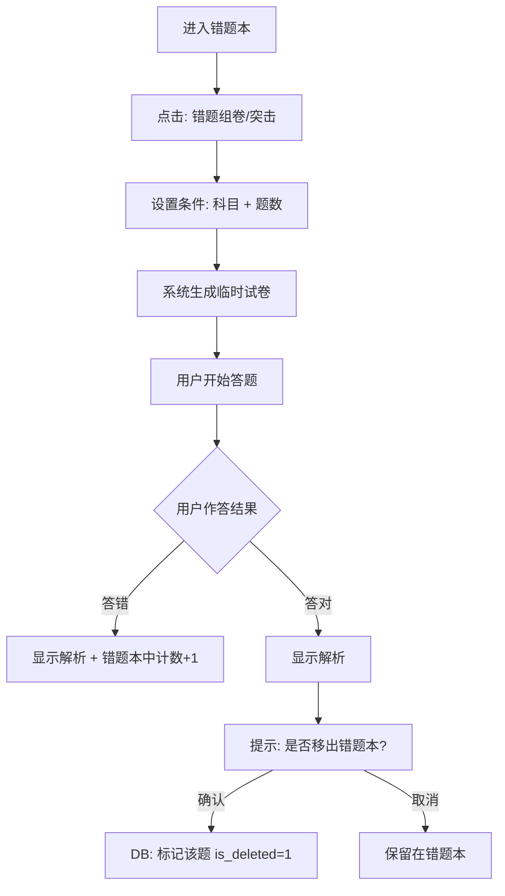
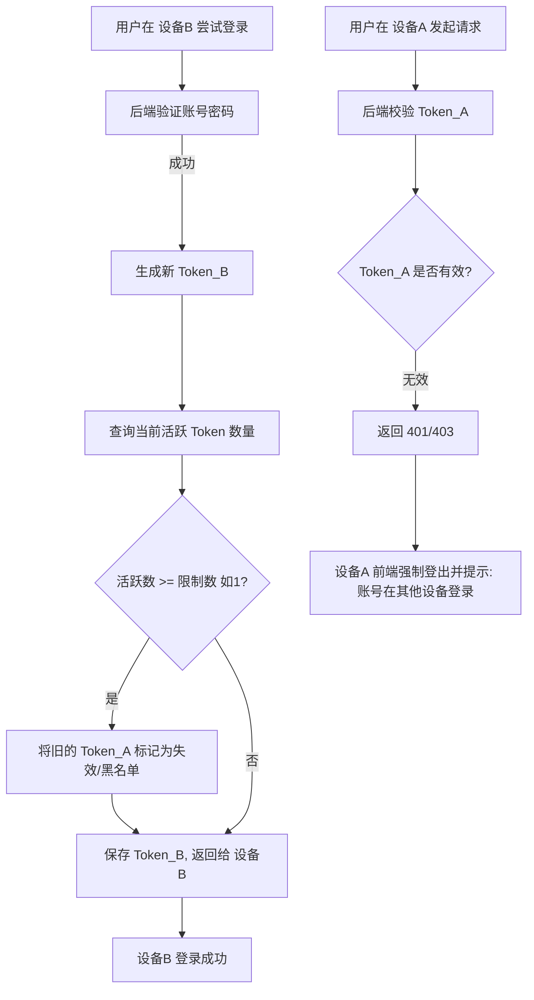
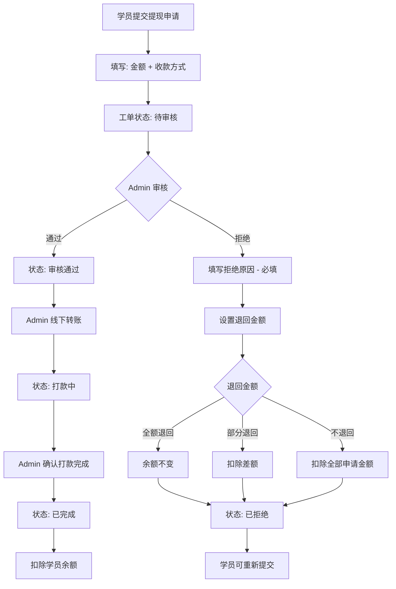

**项目名称**：医学宝典 (Medical Bible)  
**文档版本**：v3.0（Final）  
**项目类型**：在线医学考试刷题与学习平台（SaaS）  
**目标用户**：中国大陆医学生及医疗从业人员  
**核心载体**：  
- 第一阶段：PC Web 端（全功能：学员端 + 教师端 + Admin 端）  
- 第二阶段：微信小程序（仅学员端，包含刷题、讲义、推广全功能）  
**商业模式**：SKU 订阅制（按职业大类 + 等级 + 时间周期付费）  
**更新日期**：2025-11-30  

---

## 1. 项目概述与核心逻辑

### 1.1 项目背景
打造一个垂直领域的医学考试辅助平台，通过“刷题 + 讲义 + 重点标注”形成完整闭环学习体验，帮助医学生及从业人员高效通过各类职业资格考试。结合一级分销机制实现用户裂变增长。

### 1.2 核心数据层级（SKU 架构）
系统内容与售卖基于以下树形结构，由 Admin 动态配置：
```
大类 (Profession)
└── 等级 (Level)  ←【售卖核心单元】
└── 科目 (Subject)
└── 资源（试卷 + 讲义PDF）
```

示例：
- 大类：临床检验师、执业药师、护理学
- 等级：士、师、中级、主管
- 科目：临床血液学、免疫学、药事管理与法规等

### 1.3 角色定义
| 角色       | 权限说明                              |
|------------|---------------------------------------|
| 学员 (Student)   | 终端用户：刷题、组卷、看讲义、推广赚钱             |
| 教师 (Teacher)   | 内部运营：题目录入、讲义画重点                   |
| 管理员 (Admin)   | 超级管理员：系统配置、财务审核、用户管控             |

---

## 2. 功能模块详解

### 2.1 模块一：用户中心与鉴权 (User & Auth)

| 功能ID | 功能名称             | 详细需求说明                                                                 |
|--------|----------------------|------------------------------------------------------------------------------|
| U-01   | 多方式注册/登录       | 1. 手机号 + 验证码/密码<br>2. 邮箱 + 验证码/密码<br>3. 微信登录（Web 扫码 / 小程序授权，预留 UserID 关联字段） |
| U-02   | 推广关系绑定         | 注册即永久绑定，不可更改<br>• 链接注册：URL 带 `invite_code` → 自动填充并锁定<br>• 手动填写或留空 → 可为空（无上线） |
| U-03   | 注册熔断开关         | Admin 可全局关闭注册，前端隐藏入口或提示“暂停注册”                                 |
| U-04   | 多设备登录限制       | Admin 可设置"单账号最大同时在线设备数"（默认 1）<br>新设备登录踢掉旧设备，旧设备提示"账号已在其他设备登录" |
| U-05   | 考种视角切换         | 用户购买多个等级时，可在个人中心切换当前考种，首页、题库、讲义等内容实时刷新               |
| U-06   | 设备管理             | **入口：个人中心**<br>1. 用户可查看当前登录设备列表（设备型号、IP、登录时间）<br>2. 支持用户主动踢出指定设备 |
| U-07   | 账号注销             | 1. 用户可主动申请注销账号<br>2. 注销后数据保留 7 天，之后永久删除<br>3. 若该用户是推广上线，其下线的绑定关系自动置空（parent_id = NULL）<br>4. 注销时未提现余额自动清零，不予退还 |

### 2.2 模块二：商业化与支付 (Commerce)

| 功能ID | 功能名称           | 详细需求说明                                                                 |
|--------|--------------------|------------------------------------------------------------------------------|
| P-01   | SKU 定价管理       | Admin 针对每个【大类+等级】配置三档价格：月卡 / 季卡 / 年卡                         |
| P-02   | 会员订阅流程       | 选择等级 → 选择时长 → 确认金额 → 支付宝/微信支付 → 订单状态（待支付/已支付/失败）       |
| P-03   | 权限拦截中间件     | 访问试题/讲义接口时必须校验：<br>1. 是否购买该等级<br>2. 是否在有效期内<br>不满足返回 403，前端跳收银台 |
| P-04   | 多等级购买规则     | 1. 用户可同时购买多个等级（如同时备考"药士"和"药师"）<br>2. **不支持叠加优惠**<br>3. 各等级到期时间**各自独立**计算<br>4. 续费为**单个等级单独续费**，不支持批量 |

### 2.3 模块三：推广与分销 (Affiliate)

| 功能ID | 功能名称       | 详细需求说明                                                                 |
|--------|----------------|------------------------------------------------------------------------------|
| A-01   | 一级分销逻辑   | 仅一级返利：A→B 消费 A 得佣金；B→C 消费 B 得佣金，A 与 C 无关                     |
| A-02   | 佣金比例配置   | 1. Admin 可按**等级**配置不同佣金比例（如药士 10%，药师 15%）<br>2. 新增等级若未配置比例，默认为 **0%**<br>3. 佣金不得超过下线消费金额 |
| A-03   | 佣金结算       | 下线订单"已支付" → 佣金进入上线"余额"<br>建议设置 T+N 天冻结期防退款坏账             |
| A-04   | 提现工单系统   | **状态流转**：待审核 → 审核通过 → 打款中 → 已完成<br>待审核 → 已拒绝<br><br>**拒绝规则**：<br>1. 拒绝原因**必填**<br>2. Admin 可设置退回金额（支持部分退回或不退回）<br>3. 用户可重新提交申请 |
| A-05   | 推广海报生成   | 1. Web 端 + 小程序端均支持生成带个人邀请码的推广海报<br>2. 小程序支持分享到微信好友/群，带自定义卡片样式<br>3. 海报包含二维码，扫码自动带 invite_code |

### 2.4 模块四：核心刷题系统 (Question Bank)  
**所有题目均为单项选择题**

| 功能ID | 功能名称           | 详细需求说明                                                                                     |
|--------|--------------------|------------------------------------------------------------------------------------------------|
| Q-01   | 试卷结构           | 科目 → 试卷（真题标年份套数 / 模拟题标套数）→ 题目                                                 |
| Q-02   | 考试模式           | 全屏沉浸、无实时答案、有可选倒计时 → 必须交卷 → 统一判分 → 结果页展示总分 + 错题 + 全卷解析<br>**题目顺序：每次随机打乱**（不同用户/不同次答题顺序不同）           |
| Q-03   | 练习模式           | 逐题展示 → 选完立即显示对错 + 解析（含正确答案 + 知识点注解）<br>**两种模式可选**：<br>1. 顺序练习：按试卷原题号顺序<br>2. 随机练习：打乱题目顺序                                      |
| Q-04   | 错题本（自动）     | 无论考试/练习，做错自动入库，记录错误次数、最后错误时间<br>**支持按科目维度筛选错题** |
| Q-05   | 错题组卷（自定义） | 错题本 → 选科目 + 题数 → 生成临时试卷<br>**模式选择**：顺序练习 / 随机练习<br>答对后弹窗"是否移出错题本"，确认后逻辑删除（is_deleted=1）<br>**移出后不支持恢复** |
| Q-06   | 题目变更处理       | 1. 题目答案/解析被修改后，历史记录**按最新内容显示**<br>2. 若用户历史答案与新答案冲突（原来对现在错），该题**不计入总分**，不显示特殊标记<br>3. 此类题目**不自动进入错题本**<br>4. 题目被删除后，对应错题本记录**同步清除** |

### 2.5 模块五：讲义与重点 (Lecture & Highlights)

| 功能ID | 功能名称           | 详细需求说明                                                                                     |
|--------|--------------------|------------------------------------------------------------------------------------------------|
| L-01   | PDF 阅读器         | 内置支持缩放、翻页、目录跳转（Web + 移动端良好体验）<br>**分页加载**：加载当前页及前后数页，优化大文件性能<br>**不支持离线下载**（讲义属于平台资产，学员仅有观看权） |
| L-02   | 阅读进度记忆       | 记录每本讲义最后停留页码，下次打开自动跳转                                                       |
| L-03   | 教师画重点（Web）  | 教师用高亮笔/下划线工具涂抹 → 保存坐标 JSON（不改原 PDF）<br>**多教师支持**：同一科目可多教师画重点<br>**教师可删除/修改已画的重点** |
| L-04   | 重点展示（学员端） | 打开 PDF 时**按页加载坐标数据** → 在上层渲染半透明色块<br>**更新机制**：非 WebSocket，刷新/翻页时获取最新                        |
| L-05   | 重点索引           | 提取所有被标注页码生成"重点目录"，点击快速跳转                                                   |

### 2.6 模块六：后台管理系统 (Admin Dashboard)

| 功能ID | 功能名称           | 详细需求说明                                                                 |
|--------|--------------------|------------------------------------------------------------------------------|
| AD-01  | 分类树配置         | 大类 → 等级 → 科目的增删改查                                                  |
| AD-02  | 内容录入           | 试卷管理 + 题目 Excel 批量导入（必须）+ 手动录入                                |
| AD-03  | 用户管理           | 用户列表（搜索、封禁）、设备数配置、注册开关                                    |
| AD-04  | 工单/财务          | 提现工单审核（状态流转见 A-04）、打款确认、余额流水查询                          |
| AD-05  | 数据看板           | **用户数据**：<br>• 用户增长趋势（日/周/月新增）<br>• 用户活跃度统计（DAU/MAU）<br><br>**销售数据**：<br>• 销售额统计（按等级、按时间段）<br>• 订单转化率<br><br>**内容数据**：<br>• 热门科目/试卷排行<br>• 刷题数据分析（平均正确率、高频错题）<br><br>**推广数据**：<br>• 推广效果排行（谁带来用户最多）<br>• 佣金排行榜<br><br>**导出功能**：支持报表导出 |

### 2.7 模块七：微信小程序 (WeChat Mini Program)

> **说明**：小程序为第二阶段开发，仅包含学员端功能，不含教师端和 Admin 端。

| 功能ID | 功能名称           | 详细需求说明                                                                 |
|--------|--------------------|------------------------------------------------------------------------------|
| MP-01  | 登录与账号同步     | 1. 微信授权登录<br>2. 支持绑定已有 Web 端账号（手机号/邮箱）<br>3. 学习进度、错题本、订阅状态与 Web 端**实时同步** |
| MP-02  | 刷题功能           | 完整复刻 Web 端刷题体验：<br>• 考试模式（随机题序）<br>• 练习模式（顺序/随机可选）<br>• 错题本与错题组卷 |
| MP-03  | 讲义阅读           | 1. PDF 阅读器（分页加载）<br>2. 重点展示（按页加载坐标数据）<br>3. 阅读进度同步 |
| MP-04  | 支付订阅           | 使用**微信支付**完成订阅购买                                                   |
| MP-05  | 推广分销           | 1. 生成个人推广海报（含二维码 + 邀请码）<br>2. 支持分享到微信好友/群（自定义卡片样式）<br>3. 查看下线列表与佣金余额<br>4. 提现申请（与 Web 端共用工单系统） |
| MP-06  | 个人中心           | 考种切换、设备管理、账号注销、订阅管理                                         |

---

## 3. 关键业务流程图 (Mermaid)

### 3.1 注册与分销绑定流程

### 3.2 错题组卷与消灭流程

### 3.3 设备登录互踢流程


### 3.4 提现工单审核流程

## 4. 非功能性需求 (NFR)

### 数据安全性
- 密码必须加盐哈希存储
- PDF 文件防盗链（Referer 校验或短期 Token 签名 URL）

### 并发性能
- 考前高峰期支持高并发读题，热门试卷结构建议 Redis 缓存

### 兼容性
- Web 端兼容 Chrome、Edge、Safari
- PDF 阅读器移动端 H5 需流畅


## 5. 附录：开发建议
### 技术栈推荐

- **前端**：React + TypeScript（Web 端）
- **小程序**：Uni-app（复用 Web 端组件逻辑）
- **后端**：Node.js（Express/Koa/NestJS）
- **数据库**：MySQL（关系型） + Redis（缓存、Session、热门数据）

### 本地化与用户体验要求

> **重要**：本项目面向中国大陆用户，前端开发需严格遵循以下本地化规范：

| 类别 | 要求说明 |
|------|----------|
| **界面语言** | 全站中文界面，不出现未翻译的英文（技术术语如 PDF 除外） |
| **日期格式** | 使用 `YYYY年MM月DD日` 或 `YYYY-MM-DD` 格式，周起始日为**周一** |
| **时间格式** | 使用 24 小时制，如 `14:30` |
| **时区** | 统一使用北京时间（UTC+8），服务器时间与前端显示保持一致 |
| **货币单位** | 人民币（¥ / 元），金额显示保留 2 位小数 |
| **手机号格式** | 11 位中国大陆手机号，支持 +86 前缀 |
| **验证码** | 支持国内短信服务商（阿里云/腾讯云短信） |
| **支付方式** | 支付宝、微信支付（小程序端仅微信支付） |
| **字体** | 优先使用系统中文字体：`-apple-system, "PingFang SC", "Microsoft YaHei", sans-serif` |
| **输入法兼容** | 表单输入需兼容中文输入法，避免输入过程中触发提交 |
| **敏感词过滤** | 用户生成内容（如昵称）需过滤违规词汇 |
| **节假日考虑** | 数据看板可按中国法定节假日分析（可选） |

### 建议开发优先级
- 数据库表结构设计（SKU 树 + 题目表为核心）
- Admin 后台（必须先有内容才能测学员端）
- Web 学员端核心闭环（注册 → 购买 → 刷题 → 错题本）
- 推广分销与提现工单系统
- 讲义重点功能
- 小程序版本（第二阶段）