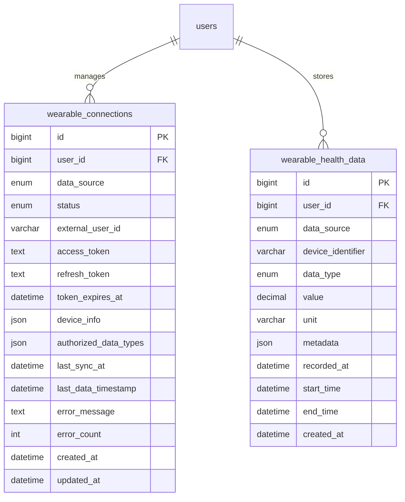

# Wearable Health Data Model Design

> **Task**: INNOV-003 - Investigate wearable device integration
> **Date**: 2026-02-08
> **Status**: Design Complete

---

## Overview

This document describes the database schema design for storing health data from wearable devices (Apple HealthKit, Android Health Connect, and third-party aggregators).

---

## Entity Relationship Diagram



---

## Table Descriptions

### 1. wearable_connections

Manages user connections to health data platforms.

| Column | Type | Description |
|--------|------|-------------|
| id | BIGINT | Primary key |
| user_id | BIGINT | User ID (FK to users) |
| data_source | ENUM | 'healthkit', 'health_connect', 'third_party' |
| status | ENUM | 'active', 'disconnected', 'revoked', 'error' |
| external_user_id | VARCHAR(255) | External platform user identifier |
| access_token | TEXT | Encrypted OAuth token (for third-party) |
| refresh_token | TEXT | Encrypted refresh token (for third-party) |
| token_expires_at | DATETIME | Token expiration timestamp |
| device_info | JSON | Device metadata (name, model, etc.) |
| authorized_data_types | JSON | List of granted data types |
| last_sync_at | DATETIME | Last successful sync timestamp |
| last_data_timestamp | DATETIME | Last data timestamp (for incremental sync) |
| error_message | TEXT | Error details on sync failure |
| error_count | INT | Consecutive failure count |
| created_at | DATETIME | Connection creation time |
| updated_at | DATETIME | Last update time |

### 2. wearable_health_data

Stores normalized health data from wearables.

| Column | Type | Description |
|--------|------|-------------|
| id | BIGINT | Primary key |
| user_id | BIGINT | User ID (FK to users) |
| data_source | ENUM | 'healthkit', 'health_connect', 'third_party' |
| device_identifier | VARCHAR(100) | Device/model identifier |
| data_type | ENUM | Health data type (see below) |
| value | DECIMAL(12,4) | Numeric value for simple metrics |
| unit | VARCHAR(20) | Unit of measurement |
| metadata | JSON | Complex data structure |
| recorded_at | DATETIME | When the data was recorded on device |
| start_time | DATETIME | Start time for duration-based data |
| end_time | DATETIME | End time for duration-based data |
| created_at | DATETIME | Server ingestion timestamp |

---

## Health Data Types

| Data Type | HealthKit | Health Connect | Unit | Use Case |
|-----------|-----------|----------------|------|----------|
| steps | StepCount | StepsRecord | count | Daily step count |
| heart_rate | HeartRate | HeartRateRecord | bpm | Cardiovascular health |
| sleep | SleepAnalysis | SleepSessionRecord | hours | Sleep quality tracking |
| active_calories | ActiveEnergyBurned | TotalCaloriesBurnedRecord | kcal | Calorie expenditure |
| distance | DistanceWalkingRunning | DistanceRecord | meters | Activity tracking |
| blood_pressure | BloodPressure | BloodPressureRecord | mmHg | Health monitoring |
| weight | BodyMass | WeightRecord | kg | Weight tracking |
| blood_oxygen | OxygenSaturation | OxygenSaturationRecord | % | Respiratory health |
| body_temperature | BodyTemperature | BodyTemperatureRecord | °C | Health monitoring |

---

## Metadata Schema Examples

### Sleep Data Metadata
```json
{
  "sleep_stages": [
    { "stage": "awake", "duration": 1200, "start_time": "2026-02-08T22:00:00Z" },
    { "stage": "rem", "duration": 5400, "start_time": "2026-02-08T22:20:00Z" },
    { "stage": "deep", "duration": 7200, "start_time": "2026-02-08T00:30:00Z" }
  ],
  "sleep_quality_score": 85,
  "interruptions": 2
}
```

### Blood Pressure Metadata
```json
{
  "systolic": 120,
  "diastolic": 80,
  "measurement_context": "resting",
  "body_position": "sitting"
}
```

### Heart Rate Metadata
```json
{
  "samples": [
    { "timestamp": "2026-02-08T10:00:00Z", "value": 72 },
    { "timestamp": "2026-02-08T10:01:00Z", "value": 75 }
  ],
  "average": 73,
  "min": 68,
  "max": 82
}
```

---

## API Data Format (Proof of Concept)

### POST /wearable/health-data

**Request Body:**
```json
{
  "dataSource": "healthkit",
  "deviceInfo": {
    "name": "Apple Watch Series 9",
    "model": "Watch10,1",
    "osVersion": "watchOS 10.2"
  },
  "healthData": [
    {
      "dataType": "steps",
      "value": 8542,
      "unit": "count",
      "recordedAt": "2026-02-08T18:30:00Z",
      "startTime": "2026-02-08T00:00:00Z",
      "endTime": "2026-02-08T23:59:59Z"
    },
    {
      "dataType": "heart_rate",
      "value": 72,
      "unit": "bpm",
      "recordedAt": "2026-02-08T18:30:00Z",
      "metadata": {
        "context": "resting"
      }
    },
    {
      "dataType": "sleep",
      "recordedAt": "2026-02-08T07:00:00Z",
      "startTime": "2026-02-07T23:00:00Z",
      "endTime": "2026-02-08T07:00:00Z",
      "metadata": {
        "duration": 28800,
        "quality": "good"
      }
    }
  ]
}
```

---

## Index Strategy

### wearable_connections
- `idx_wearable_connections_user_source` (UNIQUE): Ensures one connection per source
- `idx_wearable_connections_status`: Query by connection status
- `idx_wearable_connections_last_sync`: Find connections needing sync

### wearable_health_data
- `idx_wearable_health_user_type_time`: Query user's data by type and time
- `idx_wearable_health_user_source`: Query by data source
- `idx_wearable_health_recorded_at`: Time-range queries

---

## Data Retention Policy

| Data Type | Retention Period | Rationale |
|-----------|------------------|-----------|
| Heart rate | 90 days | High volume, patterns matter more than raw data |
| Steps | 365 days | Daily aggregates useful |
| Sleep | 365 days | Important for health insights |
| Blood pressure | 5 years | Medical history relevance |
| Weight | 5 years | Long-term health tracking |
| Other | 180 days | Default retention |

---

## Security Considerations

1. **Token Storage**: `access_token` and `refresh_token` must be encrypted at rest
2. **Data Access**: Health data is sensitive - enforce strict RBAC
3. **Audit Trail**: Log all access to health data
4. **Data Minimization**: Only collect data types with explicit user consent
5. **Right to Deletion**: Support user-initiated data deletion

---

## Related Files

- Entity: `server/src/entities/wearable-connection.entity.ts`
- Entity: `server/src/entities/wearable-health-data.entity.ts`
- Migration: `server/database/migrations/wearable-integration.sql`
- Research: `doc/wearable-integration-research.md`
